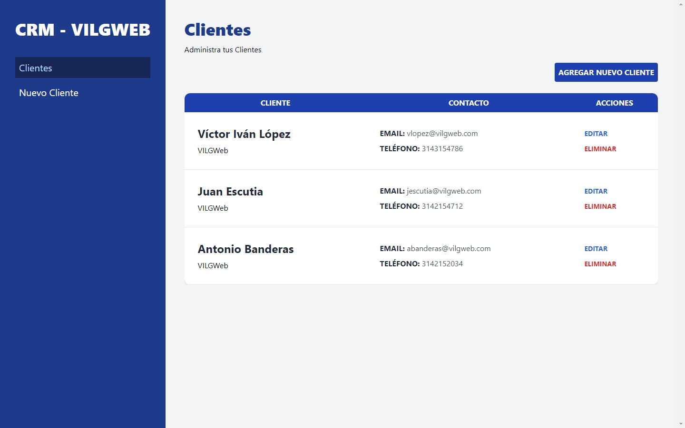
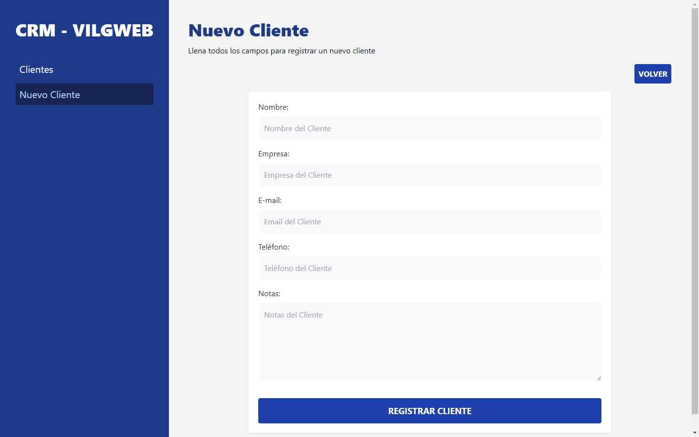
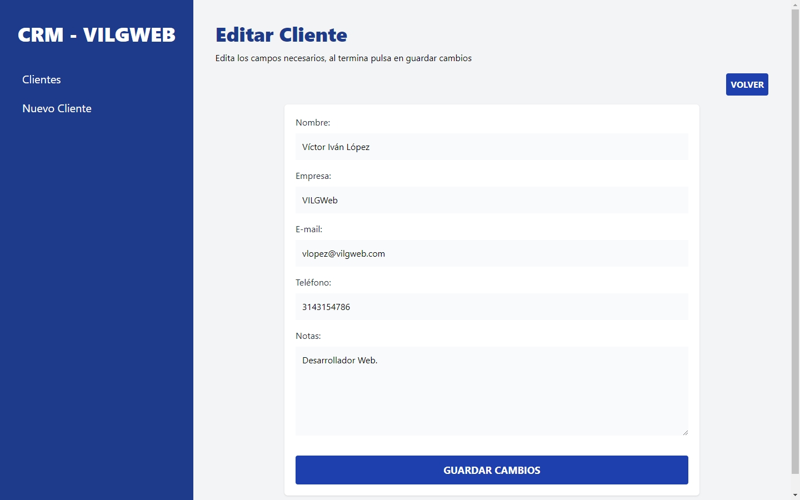

# CRM | React - React Router DOM - Tailwind - JSON Server - Vite

## Description
- CRUD.
- Endpoint creation with JSON Server.
- React development for the interface.
- Routing with React Router DOM V6.4.
- Using Tailwind CSS for interface styles.

## Preview
| **Home** |
| :-------------: |
|  |

| **New Client** |
| :-------------: |
|  |

| **Edit Client** |
| :-------------: |
|  |

## Installation

To install and run the project locally, follow these steps:

1. To clone and run this application, you'll need [Git](https://git-scm.com/) and [Node.js](https://nodejs.org/es) (which comes with npm) installed on your computer.
2. Clone the repository: `git clone https://github.com/victorivanlopezlearning/crm-react.git`
3. Navigate to the project directory: `cd crm-react`
4. Install the dependencies: `npm install`
5. Start JSON Server: `npm run server`
6. Remove .template from .env.template file.
7. In the environment variable (VITE_BASE_URL) of the .env file. Indicates the URL provided by JSON Server. For example: `VITE_BASE_URL = http://localhost:3000`
8. In another terminal start development server from Vite: `npm run dev`
9. Open your browser and visit the URL provided by development server. See the application in action.

## Built with

- JavaScript Library - [React](https://es.react.dev/)
- [React Router](https://reactrouter.com/en/main)
- CSS Styles - [Tailwind](https://tailwindcss.com/)
- Mobile-first workflow
- [JSON Server](https://github.com/typicode/json-server)
- Build Tool - [Vite](https://vitejs.dev)